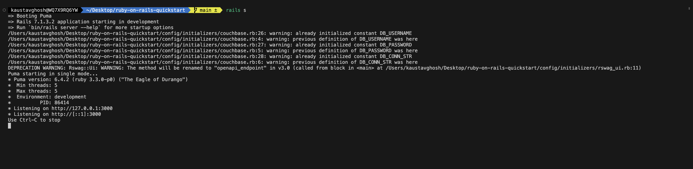
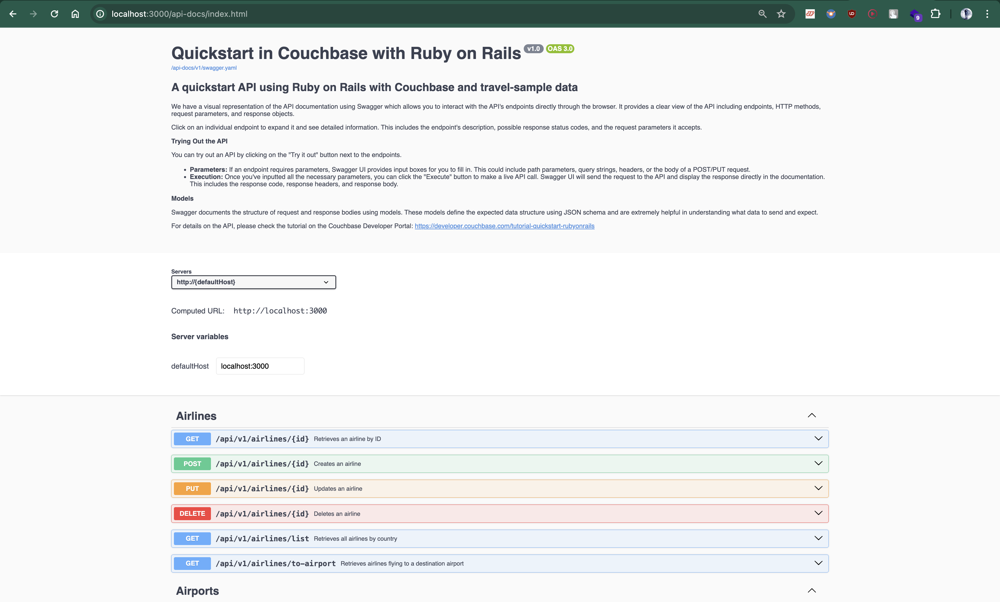

# Quickstart in Couchbase with Ruby on Rails

## Build a REST API with Ruby on Rails and Couchbase

Often, the first step developers take after creating their database is to create a REST API capable of performing Create, Read, Update, and Delete (CRUD) operations for that database. This repository is designed to teach you and provide you with a starter project (in Ruby on Rails) to generate such a REST API. Once you have installed the travel-sample bucket in your database, you can run this application, which is a REST API with Swagger documentation, to learn:

- How to create, read, update, and delete documents using Key-value operations (KV operations). Key-value operations are unique to Couchbase and provide super-fast (think microseconds) queries.
- How to write simple parameterized SQL++ queries using the built-in travel-sample bucket.

You can find the full documentation for the tutorial on the [Couchbase Developer Portal](https://www.couchbase.com/developers)

## Prerequisites

To run this prebuilt project, you will need:

- [Couchbase Capella cluster](https://www.couchbase.com/products/capella/) with [travel-sample bucket](https://docs.couchbase.com/ruby-sdk/current/ref/travel-app-data-model.html) loaded.
- To run this tutorial using a [self-managed Couchbase cluster](https://docs.couchbase.com/capella/current/getting-started/self-managed-cluster.html), please refer to the appendix.
- [Ruby 3.4.1](https://www.ruby-lang.org/en/documentation/installation/) is installed on the local machine.
- [rbenv](https://github.com/rbenv/rbenv) is recommended for managing Ruby versions (see Ruby-on-Rails-install.md for installation guide).
- Basic knowledge of [Ruby](https://www.ruby-lang.org/en/documentation/), [Ruby on Rails](https://rubyonrails.org/), and [RSpec](https://rspec.info/).

### Ruby Version Management

This project uses Ruby 3.4.1. We recommend using rbenv for managing Ruby versions. The `.ruby-version` file in the repository root will automatically configure rbenv to use the correct Ruby version.

If you don't have rbenv installed, see `Ruby-on-Rails-install.md` for detailed installation instructions.

## Loading Travel Sample Bucket

If travel-sample is not loaded in your Capella cluster, you can load it by following the instructions for your Capella Cluster:

- Load travel-sample bucket in Couchbase Capella

## App Setup

We will walk through the different steps required to get the application running.

### Cloning Repo

```sh
git clone https://github.com/couchbase-examples/ruby-on-rails-quickstart.git
```

### Install Dependencies

Any dependencies will be installed by running the bundle install command, which installs any dependencies required for the project.

```sh
bundle install
```

### Setup Database Configuration

To learn more about connecting to your Capella cluster, please follow the instructions.

Specifically, you need to do the following:

Create the database credentials to access the travel-sample bucket (Read and Write) used in the application.
Allow access to the Cluster from the IP on which the application is running.
All configuration for communication with the database is read from the environment variables. We have provided a convenience feature in this quickstart to read the environment variables from a local file, dev.env.example.

Create a copy of dev.env.example file, rename it to dev.env and add the values for the Couchbase connection.

```sh
DB_CONN_STR=<connection_string>
DB_USERNAME=<user_with_read_write_permission_to_travel-sample_bucket>
DB_PASSWORD=<password_for_user>
```

Note: The connection string expects the couchbases:// or couchbase:// part.

## Running The Application

### Directly on machine

At this point, we have installed the dependencies, loaded the travel-sample data and configured the application with the credentials. The application is now ready and you can run it.

The application will run on a port specified by Rails. You can find the port in the terminal after running the application. You will find the Swagger documentation at [http://localhost:3000/api-docs](http://localhost:3000/api-docs) of the API if you go to the URL in your browser.

```sh
rails server
```

### Using Docker

- Build the Docker image

```sh
docker build -t couchbase-rails-quickstart .
```

- Run the Docker image

```sh
docker run -p 3000:3000 couchbase-rails-quickstart -e DB_CONN_STR=<connection_string> -e DB_USERNAME=<user_with_read_write_permission_to_travel-sample_bucket> -e DB_PASSWORD=<password_for_user>
```

> Note: The dev.env.example file in the root folder has the connection information to connect to your Capella cluster. Create a copy of dev.env.example file and rename it to dev.env and add the values for the Couchbase connection.

## Verifying the Application

Once the application starts, you can see the details of the application on the terminal.



The application will run on the port specified by Rails on your local machine (eg: http://localhost:3000). You will find the interactive Swagger documentation of the API if you go to the URL in your browser. Swagger documentation is used in this demo to showcase the different API endpoints and how they can be invoked. More details on the Swagger documentation can be found in the appendix.



## Running The Tests

Create a copy of dev.env.example file and rename it to dev.env and add the values for the Couchbase connection.

```sh
DB_CONN_STR=<connection_string>
DB_USERNAME=<user_with_read_write_permission_to_travel-sample_bucket>
DB_PASSWORD=<password_for_user>
```

### Run the integration tests

```sh
bundle exec rspec spec/requests
```

## Troubleshooting

### Integration Tests Failing with "undefined method 'get' for nil"

This error means Couchbase is not properly initialized. Follow these steps:

#### 1. Verify Environment Variables

For local development, ensure `dev.env` file exists in project root:

```bash
cat dev.env
```

Should contain:
```
DB_CONN_STR="couchbases://cb.hlcup4o4jmjr55yf.cloud.couchbase.com"
DB_USERNAME="your-username"
DB_PASSWORD="your-password"
```

#### 2. Verify Couchbase Connection

Test the connection:
```bash
bundle exec rails runner 'puts COUCHBASE_CLUSTER ? "✓ Connected" : "✗ Not connected"'
```

#### 3. Verify travel-sample Bucket

The application requires the `travel-sample` bucket with:
- **Scope:** `inventory`
- **Collections:** `airline`, `airport`, `route`, `hotel`

For Couchbase Capella:
1. Log into Capella console
2. Navigate to your cluster
3. Check Buckets > travel-sample exists
4. Verify inventory scope and collections exist

#### 4. Check Permissions

The database user needs:
- Read/Write access to `travel-sample` bucket
- Query permissions for N1QL queries
- Search permissions for FTS operations

#### 5. Verify Network Access (Capella Only)

For Couchbase Capella:
1. Go to Settings > Allowed IP Addresses
2. Add your IP address or `0.0.0.0/0` for testing
3. Ensure cluster is not paused

### CI Tests Failing

Check GitHub repository configuration:

1. **Secrets** (Settings > Secrets and variables > Actions > Secrets):
   - `DB_PASSWORD` - Your Couchbase password

2. **Variables** (Settings > Secrets and variables > Actions > Variables):
   - `DB_CONN_STR` - Your Couchbase connection string
   - `DB_USERNAME` - Your Couchbase username

3. **Capella IP Allowlist**:
   - GitHub Actions runners use dynamic IPs
   - Temporarily allow `0.0.0.0/0` or use Capella's "Allow All IPs" option

### Common Errors

**Error:** `Couchbase::Error::AuthenticationFailure`
- **Solution:** Check username/password in `dev.env` or GitHub Secrets

**Error:** `Couchbase::Error::BucketNotFound`
- **Solution:** Ensure `travel-sample` bucket is created and loaded

**Error:** `Couchbase::Error::Timeout`
- **Solution:** Check network connectivity, verify connection string uses correct protocol (`couchbase://` for local, `couchbases://` for Capella)

**Error:** `Couchbase::Error::ScopeNotFound` or `CollectionNotFound`
- **Solution:** The initializer auto-creates scope/collections, but user needs create permissions

### Health Check Endpoint

Check application health:
```bash
curl http://localhost:3000/api/v1/health
```

Response shows Couchbase status:
```json
{
  "status": "healthy",
  "timestamp": "2025-12-02T10:30:00Z",
  "services": {
    "couchbase": {
      "status": "up",
      "message": "Connected to travel-sample bucket"
    }
  }
}
```

### Getting Help

If issues persist:
1. Check application logs for detailed error messages
2. Verify Ruby version matches `.ruby-version` (3.4.1)
3. Run `bundle install` to ensure all gems are current
4. Check Couchbase SDK compatibility

# Appendix

## Data Model

For this quickstart, we use three collections, airport, airline and routes that contain sample airports, airlines and airline routes respectively. The routes collection connects the airports and airlines as seen in the figure below. We use these connections in the quickstart to generate airports that are directly connected and airlines connecting to a destination airport. Note that these are just examples to highlight how you can use SQL++ queries to join the collections.


## Extending API by Adding New Entity

If you would like to add another entity to the APIs, these are the steps to follow:

1. Create a new model: Create a new model for the entity in the `app/models` folder. This model should contain the schema for the entity.
2. Create the new route: In Rails, you can create a new route by adding a new resource in the `config/routes.rb` file. This file should contain the logic for the new entity's CRUD operations.
3. Create the new controller: Create a new controller for the entity in the `app/controllers` folder. This controller should contain the logic for the new entity's CRUD operations.
4. Add the integration tests: Add integration tests for the new entity in the `test/integration` folder. This ensures that the new entity's CRUD operations are tested. The test file should be named `<entity>_spec.rb`.

Following these steps ensures a systematic and organized approach to expanding the API functionality with a new entity.

## Running Self-Managed Couchbase Cluster

If you are running this quickstart with a self-managed Couchbase cluster, you need to load the travel-sample data bucket in your cluster and generate the credentials for the bucket by creating a user.

You need to update the connection string and the credentials in the `dev.env` file in the root folder.

Note: Couchbase Server must be installed and running prior to running this app.

## Swagger Documentation

Swagger documentation provides a clear view of the API including endpoints, HTTP methods, request parameters, and response objects.

Click on an individual endpoint to expand it and see detailed information. This includes the endpoint's description, possible response status codes, and the request parameters it accepts.

### Trying Out the API

You can try out an API by clicking on the "Try it out" button next to the endpoints.

Parameters: If an endpoint requires parameters, Swagger UI provides input boxes for you to fill in. This could include path parameters, query strings, headers, or the body of a POST/PUT request.

Execution: Once you've inputted all the necessary parameters, you can click the "Execute" button to make a live API call. Swagger UI will send the request to the API and display the response directly in the documentation. This includes the response code, response headers, and response body.

### Models

Swagger documents the structure of request and response bodies using models. These models define the expected data structure using JSON schema and are extremely helpful in understanding what data to send and expect.
